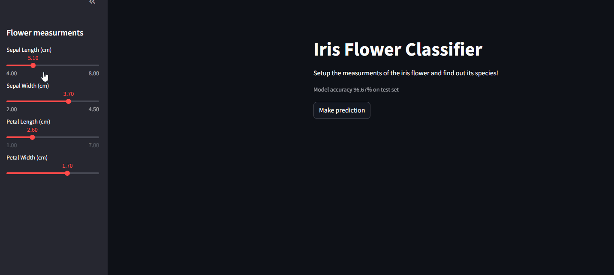

# Iris-Flower-Classifier
ML project using scikit-learn, numpy and joblib libraries to identify iris flower species
### Demo

### To open locally run:
```bash
pip install -r requirements.txt
streamlit run app.py
